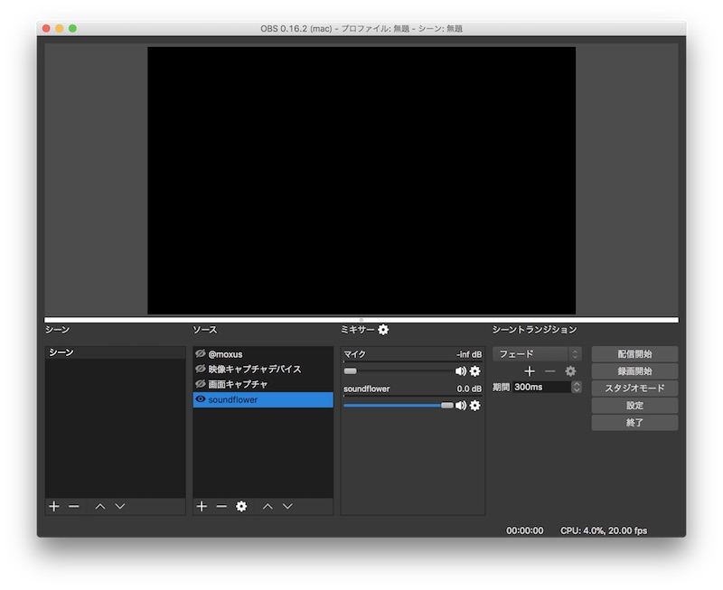
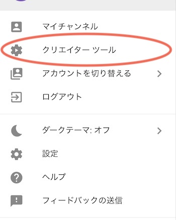
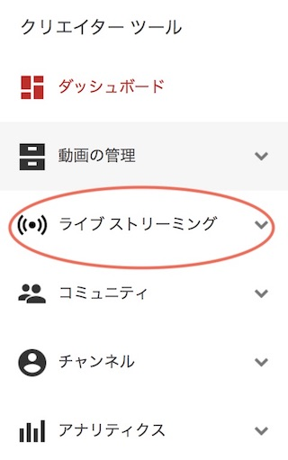
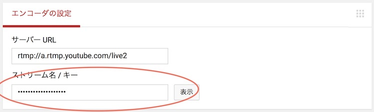
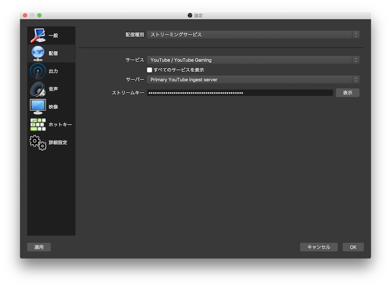
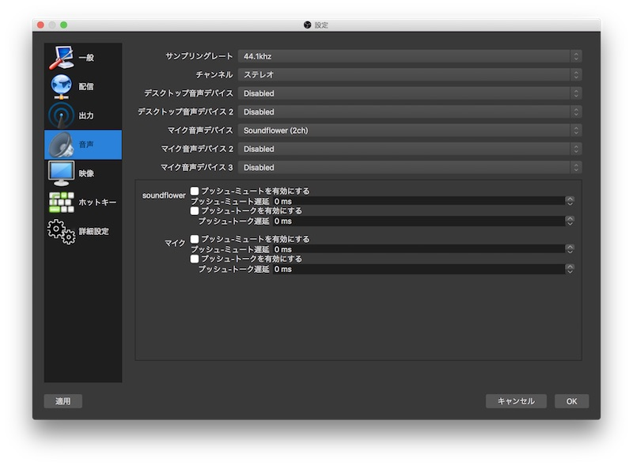
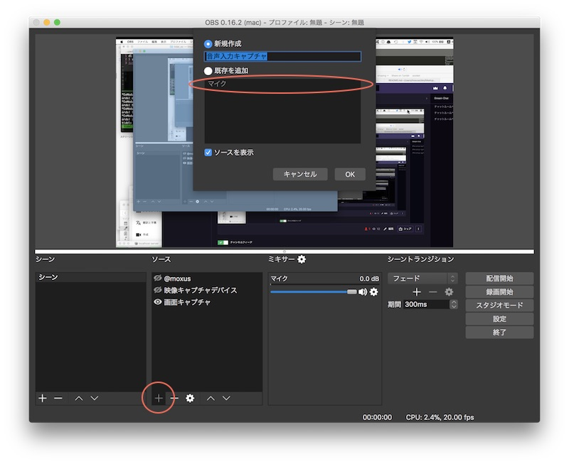
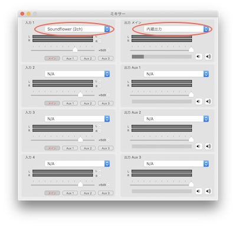

# How To Stream Desktop For Livecoding

```96ps-2e71-v4yx-9tmg```

ライブコーディングのパフォーマンスをストーリーミング配信したい時があります。

例えばAlgoraveでは実空間でのライブを中継することがあよくあります。Youtubeの[EulerRoom](http://www.eulerroom.com)チャンネルにはまとまった記録があります。これはyoutubeの ```live``` という機能でストリーミング配信ソフトを使って配信用のサーバにアクセスして行います。

youtube liveの他にもFaceBookや、twitch(ゲームの実況中継配信だけですが)などいくつか動画配信をユーザーに提供しているサービスがあります。

今回はとりあえずyoutube liveに絞って進めます。

## 配信ソフト

配信用ソフトは有償・無償のものが複数存在しますがもしOSがLinux/Mac/Windowsならオープンソースの[OBS](http://obsproject.com/)がベーシックな機能があってオススメです（cuiしかない環境ならffmpegという手もありますが）



こんな感じの画面で操作します。

## ストーリームキーの設定

配信にはrtmpというストリーミング用のプロトコルを使います。youtubeの設定パネルからストリームキーというトークンを取得して、専用ソフトに設定します。
まずはYouTubeのホーム画面へ行きます。もしyoutubeのアカウントがなければ取得しておきます。

右上にgoogleアカウントアイコンを押します。



```クリエイターツール``` を選択します。




開いたら左側のメニューから ```ライブストリーミング``` を選択します。




開いたダッシュボードの下の ```エンコーダの設定``` の ```ストリーム名 / キー``` をコピーしておきます。

今度はOBSアプリに戻って、設定ボタンを押します ```配信``` パネルに移動して、

```サービス``` >> ```YouTube / YouTube Gaming``` に

```ストリームキー``` >> に先ほどコピーしたーストリームキーを入力して ```OK``` で保存します。




## オーディオのセッティング

OBSにはデスクトップの音声出離欲をキャプチャーできないようになっています。なので[Soundflower](https://github.com/mattingalls/Soundflower/releases)や[Jack](http://www.jackaudio.org)などでルーティングする必要があります。
ここではSoundflowerでのルーティングをして行きます。

お使いのライブ用のセットの出力を ```Soundflower (2ch)``` にしておきます。自分の場合はSuperColliderのサーバーからSuperDirtを起動するのでブートする前にオプションをセットしておきます。

```
s.options.device_("Soundflower (2ch)");

SuperDirt.start();
```

OBS側で入力の音声ソースの設定をします。まず設定のパネルを開いて ```音声``` パネルを開きます。```マイク音声デバイス``` のセレクトボックスから ```Soundflower (2ch)``` を選択して ```OK``` して保存します。



次にメインパネルに戻ってソースの追加をします。```ソース``` パネルの ```+``` ボタンを押して ```音声入力キャプチャ``` を選択すると、ソースの選択モーダルが出るので先ほど設定で追加した ```既存を追加```>>```マイク``` を選択して ```OK``` で追加します。これでソースが配信にのせられるようになります。




一旦ルーティングされているかテストしてみましょう。レベルモニターが触れたら成功です。

### モニターループバック

このままだと自分の演奏をモニターできません。なんらかの方法で ```Soundflower (2ch)``` の音声をモニターします。ここでは[LadioCast](https://itunes.apple.com/jp/app/ladiocast/id411213048?mt=12)というフリーウエアのミキシング機能をを使ってモニターします。

アプリケーションを立ち上げてパネルの一番上の段の設定をします。左側の入力ソースを右側の出力ソースへマッピングするようになっています。
左側を ```Soundflower (2ch)``` 右側を ```内蔵出力``` にします。



その他にも有償ですが[Loopback](https://rogueamoeba.com/loopback/)などは高機能で同じようなルーティングができます。

これで配信準備は完了です。OBSのメインパネルに戻って ```配信開始``` ボタンで配信が開始されます。ブラウザ側ではYouYube Lievの配信配信画面で ```ライブ``` の青ランプがついたら成功です。ネットワークの状況によりますが、転送+バッファ時間分タイムラグがあります。


## 映像ソースの追加

```ソース```のプラスボタンは他にも音声以外にも映像ソースも配信映像に加えられます。例えばウェブカムを繋いでいるのであれば  ```映像キャプチャソース``` で追加することができます。追加した後ワイプのようにして好きなサイズで配置することができます。

例えば手元のキー操作や、配信中のセルフ画像をウェブカムで撮って、ワイプで置いておくのもいいかもしれません。

また ```テキスト``` ソースは画面上に文字を表示できます。自分はアカウント名を右下に小さく表示させるのに使っています。

```ゲームキャプチャ(サイフォン)``` も気になりますね。おそらくSyphonのことなので、vj用の映像をミックスするのに良さそうです。映像ソースには ```フィルタ``` 機能がついていてブレンディングや色補正などのフィルタ効果が追加できます。特に ```カラーキー`` フィルターは特定の色でソースのマスクができるので、クロマキー背景などの処理が可能です、工夫してvjのソースとライブコーディングしているエディターの画面のミックスなどに利用できそうです。


## 配信ビットレート

それぞれの配信サービスやネットワークのスピードなどによって違いますが、ビットレートの設定もコツがいるかもしれません。
ゲーム実況の無配信と違ってフレームレートもそこま高い設定でなくても良いかもしれません。もちろんvjの映像をよく見せたいのであれば高めに設定したいですが。
回線が細い場合、途切れてしまうのを避けたいので低めのビットレートやフレームレートを下げる工夫もいるかもしれません。

音声はYouTube Liveの場合160bps以上にしてもサーバー側で160にされてしまうようです。 
自分の場合サウンドパフォーマンスなので意味はないかもしれませんが、なるべく高音質で送りたいので256bpsくらいに設定しています。


