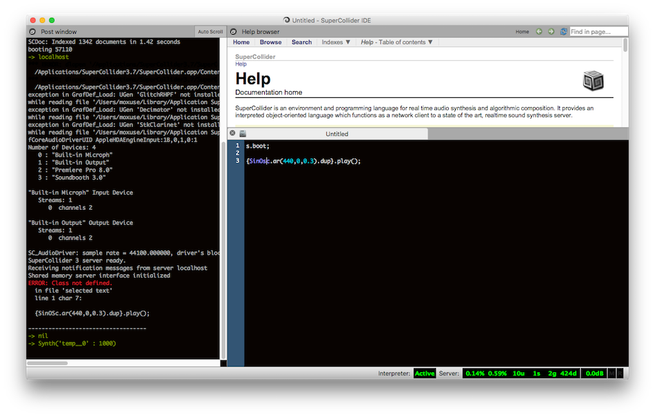

#SC入門講座
>Tokyo SuperCollider#12 @Upgrade English 2016/01/31

###1.1

###SuperColliderとは
音響合成用の統合環境（言語／IDE／実行環境などが一緒になったソフトウエア）

###特徴

  - ソフトウエア
    - オープンソース [GitHubでソースが公開されている](http://github.com/supercollider)
    - サーバクライアント型
  - 言語
    - スモールトーク由来なOOP言語
    - インタプリタ型言語(実装部分は主にC++)
  - IDE  
    - インラインで実行
    - 選べる

###まずはダウンロード

公式サイト[http://supercollider.github.io](http://supercollider.github.io)

中頃ダウンロードセクション > / Mac / Linux / Windows

###IDE(Mac)

